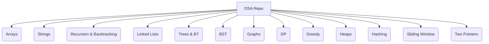
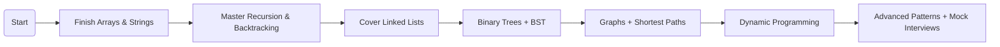

# 📘 **DSA – Data Structures & Algorithms Repository**
<p align="center">
  
</p>

<p align="center">
  
</p>

<h3 align="center">🚀 Master DSA for Interviews, Competitions & Problem-Solving</h3>

<p align="center">
  <a href="https://github.com/AviralMishra1310/DSA/stargazers"></a>
  <a href="https://github.com/AviralMishra1310/DSA/network/members"></a>
  <a href="https://github.com/AviralMishra1310/DSA"></a>
  
  
</p>

---

# ⭐ **If this repo helps you, don’t forget to →**  
<p align="center">
  <a href="https://github.com/AviralMishra1310/DSA">⭐ Star this Repository</a>
</p>

---

# 📑 **Table of Contents**
- [About the Repository](#-about-the-repository)
- [Why This Repo is Useful](#-why-this-repo-is-useful)
- [Tech Stack](#-tech-stack)
- [Repository Structure](#-repository-structure)
- [Topics Included](#-topics-included)
- [Progress Tracker](#-progress-tracker)
- [Roadmap](#-roadmap)
- [Visual Graphs](#-visual-graphs)
- [How to Use](#-how-to-use)
- [Contribution Guidelines](#-contribution-guidelines)
- [References](#-references)
- [License](#-license)

---

# 📘 **About the Repository**
This repository contains clean, optimized, and interview-ready **Data Structures and Algorithms** implementations.  
It is specially designed for:

✔ Technical interview preparation  
✔ Competitive programming  
✔ University exams  
✔ Logical thinking improvement  
✔ Building strong fundamentals  

---

# 🎯 **Why This Repo is Useful**
- 🚀 **Covers all major DSA topics**
- 🧠 **Clean code with intuitive variable names**
- 📁 **Structured topic-wise folders**
- 📌 **Includes patterns, tricks, and templates**
- 🔥 **Interview-level questions + solutions**
- ⚡ **Fast revision-friendly formatting**
- 📝 **Minimal + optimized Java solutions**

---

# 🛠️ **Tech Stack**
| Technology | Purpose |
|-----------|---------|
| **Java** | DSA solutions |
| Markdown | Documentation |
| Git & GitHub | Version control |

---

# 📂 **Repository Structure (Updated Actual Structure)**

```
DSA/
│
├── LeetCode/                # All LeetCode problems
├── GFG/                     # All GeeksForGeeks problems
│
├── MyOwn/                   # Your topic-wise structured DSA
│   ├── Arrays/
│   ├── Strings/
│   ├── Recursion-Backtracking/
│   ├── LinkedList/
│   ├── Trees/
│   ├── BinaryTree/
│   ├── BST/
│   ├── Graphs/
│   ├── DynamicProgramming/
│   ├── Greedy/
│   ├── Heaps/
│   ├── Hashing/
│   ├── SlidingWindow/
│   ├── TwoPointers/
│
└── README.md
```

---

# 📚 **Topics Included**

<details>
<summary><strong>📁 Arrays</strong></summary>

- Kadane’s Algorithm  
- Prefix/Suffix  
- Sorting & Searching  
- Dutch National Flag  
</details>

<details>
<summary><strong>🔤 Strings</strong></summary>

- Anagrams  
- Palindrome  
- KMP  
</details>

<details>
<summary><strong>🌀 Recursion & Backtracking</strong></summary>

- Subsets  
- Permutations  
- N-Queens  
</details>

<details>
<summary><strong>🔗 Linked Lists</strong></summary>

- Cycle detection  
- Reverse  
- Merge nodes  
</details>

<details>
<summary><strong>🌳 Trees | Binary Trees</strong></summary>

- DFS & BFS  
- Diameter  
- LCA  
</details>

<details>
<summary><strong>🌲 Binary Search Tree</strong></summary>

- Search/Insert/Delete  
- Validate BST  
</details>

<details>
<summary><strong>🕸 Graphs</strong></summary>

- BFS / DFS  
- Cycle detection  
- Topological sort  
- Dijkstra  
</details>

<details>
<summary><strong>⚙ Dynamic Programming</strong></summary>

- LIS  
- Knapsack  
- LCS  
</details>

<details>
<summary><strong>💠 Greedy</strong></summary>

- Activity selection  
- Fractional knapsack  
</details>

<details>
<summary><strong>📦 Heaps</strong></summary>

- Max/Min heap  
- K-largest elements  
</details>

<details>
<summary><strong>🔍 Hashing</strong></summary>

- Maps  
- Frequency tables  
</details>

<details>
<summary><strong>📏 Sliding Window</strong></summary>

- Largest/Smallest window  
</details>

<details>
<summary><strong>↔ Two Pointers</strong></summary>

- Pair sum  
- 3-sum  
</details>

---

# 📊 **Progress Tracker**

| Topic | Status | No. of Problems |
|-------|--------|-------------------|
| Arrays | ✔ Completed | 40+ |
| Strings | ✔ Completed | 30+ |
| Recursion & Backtracking | 🔄 In Progress | 20+ |
| Linked Lists | ✔ Completed | 25+ |
| Trees & Binary Trees | 🔄 In Progress | 30+ |
| BST | ✔ Completed | 15+ |
| Graphs | 🔄 In Progress | 20+ |
| Dynamic Programming | 🔄 In Progress | 35+ |
| Greedy | ✔ Completed | 20+ |
| Heaps | ✔ Completed | 15+ |
| Hashing | ✔ Completed | 10+ |
| Sliding Window | ✔ Completed | 12+ |
| Two Pointers | ✔ Completed | 12+ |

---

### **Mermaid Topic Graph**



---

# 🗺️ **Roadmap**



# 🎉 **Thank You!**
If this helped you, please ⭐ **star the repo** — it motivates continued improvement!

<p align="center">
  <a href="https://github.com/AviralMishra1310/DSA">⭐ Star Here</a>
</p>
